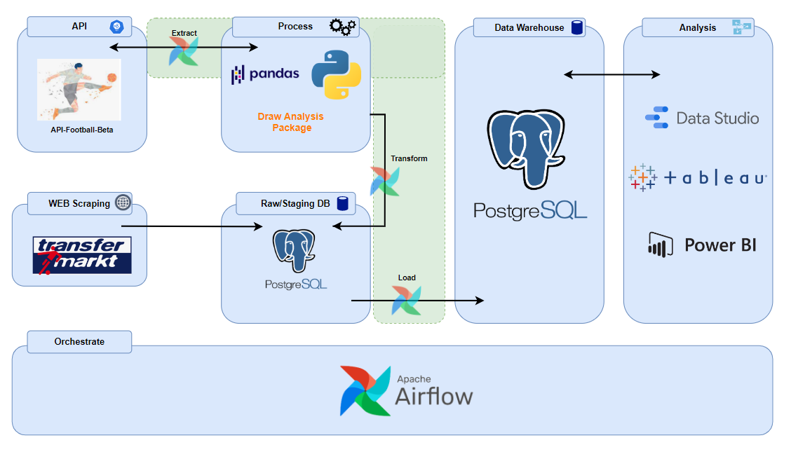

# Segunda Division Data Pipeline
Repository presents a data pipeline that provides football data and computation for match results prediction bot and for general analysis purposes. Process supplies unique data that allows to reconstruct and track teams performance round by round, such as - match results, goals, table position, draw/ no draw series, team values and many more indicators.

The Job is built on the basis of the Segunda Division but can be easily adapted to each league and season on request.
It contains two data delivering approaches - full and incremental data load.

## Table of content

1. [Architecture](#Architecture)
2. [Data Warehouse](#Data-Warehouse)
3. [Restore Historical Data](#Restore-Historical-Data)
4. [Power BI Dashboards](#Power-BI-Dashboards)
5. [Airflow Dag Description](#Airflow-Dag-Description)
6. [Tech Stack And Requirements](#Tech-Stack-And-Requirements)
7. [Reflections](#Reflections)
8. [Next features](#Next-features)

## Architecture
Football data is collected weekly (according to the league schedule) from RapidApi Api-Football-Beta with the use of Airflow Python Operator.

### Data pipeline steps (03_seg_div_data_pipeline.py):

1. Data is collected from RapidApi Api-Football-Beta on season request and save as csv file by Airflow Python Operator
2. Input undergoes transformations and data checks then pushed to Airflow x-com.
3. Data transformation and computation process:
   - results (matches played)
   - fixtures (updated season schedule)
   - league tables - total, home, away (calculated using draw_analysis python package)
   - draw/no draws series (calculated using PL/pgSQL scripts)

4. Football_db incremental load by season with Custom Airflow Operators - LoadDataToPostgres and LoadLeagueTableToPostgres
5. Data Warehouse incremental load using PL/pgSQL transcation block.

## Data Warehouse

The data warehouse is designed using fact constellation schema in which multiple fact tables share the same dimension tables.

Due to the complexity of the data, fact_standings have been separated from the main fact table and constitute a separate unit for easier analysis and debugging. It is possible to bridge the fact tables using league_id, season, round, team_id columns to recreate the full teams performance.

DW is equipped with PL/pgSQL objects and scripts that speed up and facilitate queries and data analysis
(dags/scripts/postgres_scripts/segunda_division_dw):

- B-tree indexes optimizing queries (in case of enlarging database with other leagues)

- functions (get_current_season, get_current_round, get_next_round)

- views (v_match_results, v_performance - returning full teams performance with table standings - round by round, v_match_results_pcts_league_season)

- materialized view with triggers (returning refreshed current league standings table, league-season performance view)

## Restore Historical Data

"./dags/restore_historical_data"

Python scripts that allow to execute ETL job according to given seasons and league ID at once use 'full load' paradigm. 
Process of data loading is done locally using SQL Server Integration Services package and PostgreSQL ODBC driver.

   - SSIS package: dags/restore_historical_data/csv_to_postgres_ssis/csv_to_postgres_ssis/restore_data_football_raw_db.dtsx
   - SSIS output logs: dags/restore_historical_data/csv_to_postgres_ssis/logs

## Power BI Dashboards

## Airflow Dag Description

- 01_build_database_dag.py
	- automatically creates databases, tables, airflow db and csv connections, sql objects(views, functions, 	triggers, procedures) using Python and Bash Operators
	- dag truncate existing databases

- 02_restore_data_dag.py 
	- use to restore football data for "restore historical data" process

- 03_seg_div_data_pipeline.py 
    - main data pipline dag

## Tech Stack And Requirements

- Data source: RapidAPI/ API – football, Web scraping - www.transfermarkt.com
- Docker
- Airflow 2.2.4 (python 3.7.12)
- Bash
- draw_analysis python package
- PostgreSQL 13.6
- PostgreSQL ODBC driver
- SQL Server Integration Services 14.0
- Power BI Desktop 

IDE: Pycharm, PgAdmin 4, Visual Studio 2017

## Reflections
- process is geared towards acquiring the most relevant data, facts, indicators and figures (ignoring less important dimensions)
- why not surrogate keys ? At this stage, the data is highly unified and protected against changes (fixed names of leagues and teams, no sponsors in proper names, unified league levels)
- combining data from different sources is done using python "match algorithm" (details in repository - "segunda_division_draw_analysis" ./3_external_variables/02_team_names_match_algorithm.ipynb)
- poor performance of SSIS and PostgreSQL ODBC driver (switch to Apache Nifi in future)
- "draw analysis python package" is not customized for data pipeline process (new highly optimized python class in future)

## Next Features
- 'pre-match odds' dimension data
- monthly 'team values' fact table
- transition from SSIS to Apache NiFi
- build new python app for restoring historical data (full data load approach)
- AWS S3 football raw data storage
- data pipeline and data warehouse performance tests
- code refactoring